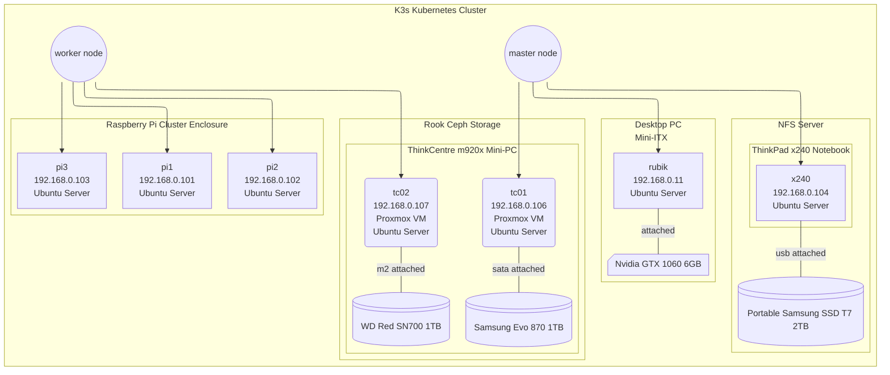

# Homelab Architecture Diagram

## Overview

This document describes the current homelab architecture as configured through Ansible.

## Architecture Diagram

```mermaid
---
config:
  layout: elk
---

graph TB

    subgraph "K3s Kubernetes Cluster"
        direction TB
        master(("master node"))
        worker(("worker node"))

        subgraph "Raspberry Pi Cluster Enclosure"
            pi1["pi1<br/>192.168.0.101<br/>Ubuntu Server"]
            pi2["pi2<br/>192.168.0.102<br/>Ubuntu Server"]
            pi3["pi3<br/>192.168.0.103<br/>Ubuntu Server"]
        end

        subgraph "Rook Ceph Storage"
            subgraph "ThinkCentre m920x Mini-PC"
                direction LR
                tc01("tc01<br/>192.168.0.106<br/>Proxmox VM<br/>Ubuntu Server")
                tc02("tc02<br/>192.168.0.107<br/>Proxmox VM<br/>Ubuntu Server")
                ssd2@{shape: lin-cyl, label: "Samsung Evo 870 1TB"}
                ssd1@{shape: lin-cyl, label: "WD Red SN700 1TB"}
                tc01--sata attached ---ssd2
                tc02--m2 attached ---ssd1
            end
        end

        subgraph "NFS Server"
            subgraph "ThinkPad x240 Notebook"
                x240["x240<br/>192.168.0.104<br/>Ubuntu Server"]
            end
            essd@{shape: lin-cyl, label: "Portable Samsung SSD T7 2TB"}
            x240--usb attached ---essd
        end

        subgraph "Desktop PC<br/>Mini-ITX"
            rubik["rubik<br/>192.168.0.11<br/>Ubuntu Server"]
            gpu@{ shape: notch-rect, label: "Nvidia GTX 1060 6GB" }
            rubik--attached ---gpu
        end

        master --> tc01
        master --> x240
        master --> rubik
        worker --> tc02
        worker --> pi1
        worker --> pi2
        worker --> pi3

    end

```
